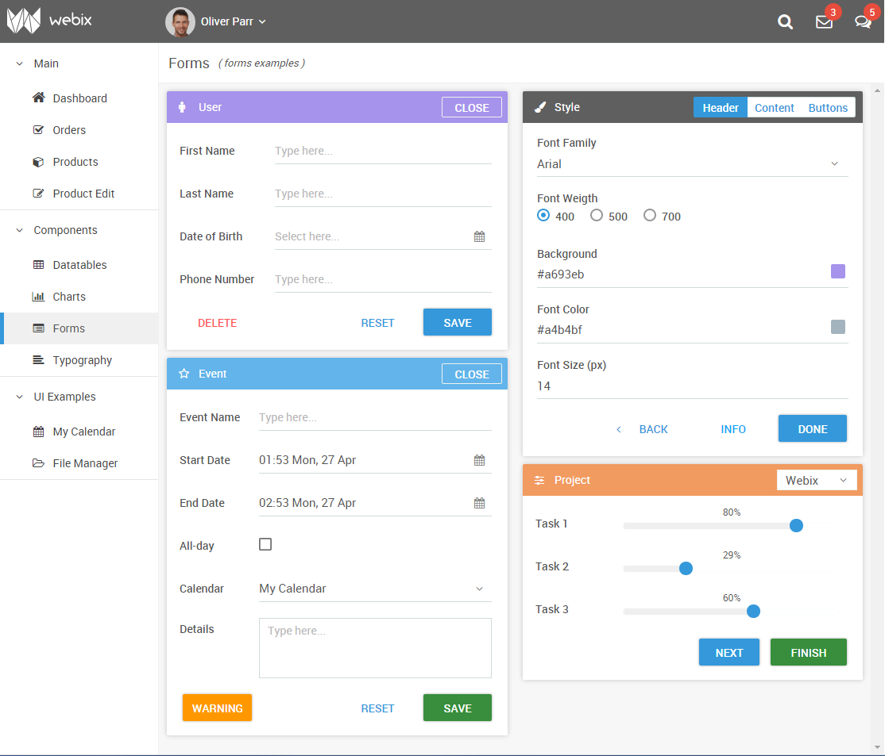

# Material Design skin for [meteor-Webix](https://atmospherejs.com/webix/webix)

Requires Webix 2.3+. Check the [live demo](http://webix.com/demos/material/admin-app/index.html#!/app/forms)!

## Usage

    meteor add webix:skin-material-design
    
    
## More information

* [upstream Material Design skin README](material-design-skin/readme.md).
* [Using Webix skins](http://docs.webix.com/desktop__skins.html)
* [Skin builder](http://webix.com/skin-builder/)
